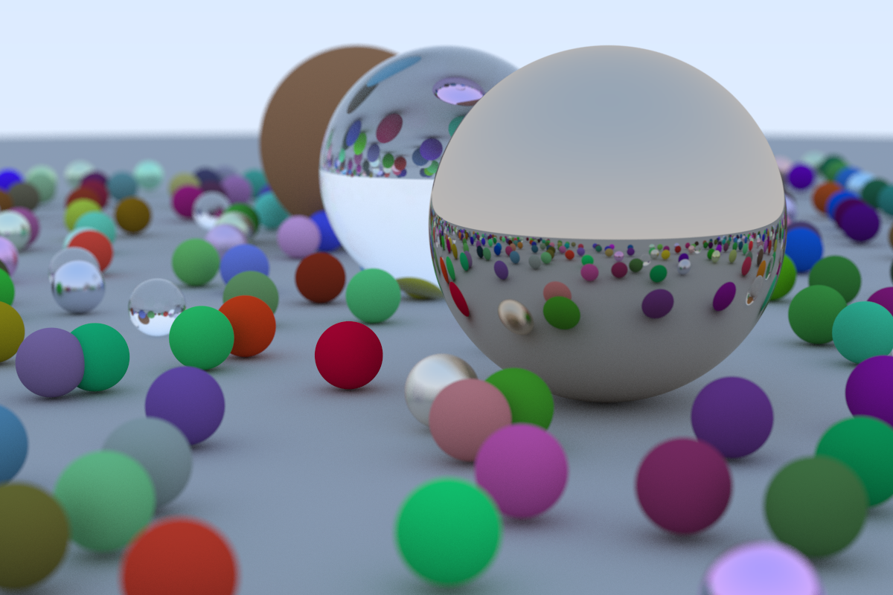

# Ray Tracer

Created following along from [Ray Tracing in One Weekend](https://raytracing.github.io/books/RayTracingInOneWeekend.html "Ray Tracing in One Weekend") (which uses c++).

Example of a render:

.
